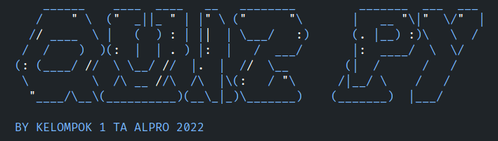

# Quiz Py



**Quiz Py** is a simple quiz program created using the Python programming language. This Quiz Py program was developed as an academic project. I hope you enjoy using it and learn more about Python programming through this project.

## Main Features

Here are the main features of the Quiz Py program:

- **Quiz Theme Selection**: The program allows users to select the theme of the quiz to be taken. Users can choose from a variety of themes available.
- **Answer Scoring**: After answering the questions in the quiz, the program will provide feedback on the correct and incorrect answers. In addition, the final score will also be displayed to the user.
- **"Play Again" feature**: Users can easily take the quiz again without having to restart the program. This "Play Again" feature allows users to continue practicing and improving their scores.
- **Ease of Adding Questions**: The program is designed to make it easy to add new questions to the quiz. Users can change the question data without having to change the logic code of the program.
- **User Friendly Interface**: Users will be presented with an attractive and easy to understand interface. This aims to provide a pleasant experience while taking the quiz.

## Usage Guide

To use the Quiz Py program, follow these steps:

1. Make sure you have Python installed on your computer.
2. Clone this repository to your computer:

   ```bash
   git clone https://github.com/shafygunawan/quiz-py.git
   ```

3. Open the Quiz Py repository in the terminal:

   ```bash
   cd quiz-py
   ```

4. Run the program by running the main file:

   ```bash
   python quiz.py
   ```

5. Select the quiz theme you want to work on.
6. Follow the instructions that appear on the screen to answer the questions in the quiz.
7. Once completed, the program will display your feedback and score.
8. If you wish to take the quiz again, use the "Play Again" option provided.

## Support Me

If you find this project useful and would like to support me, you can <a href="https://www.buymeacoffee.com/shafygunawan" target="_blank">Buy Me a Coffee</a>.

## License

This project is licensed under the MIT License. More details can be found in the [LICENSE](https://github.com/shafygunawan/quiz-py/blob/main/LICENSE) file.

Thank you for using Quiz Py!
